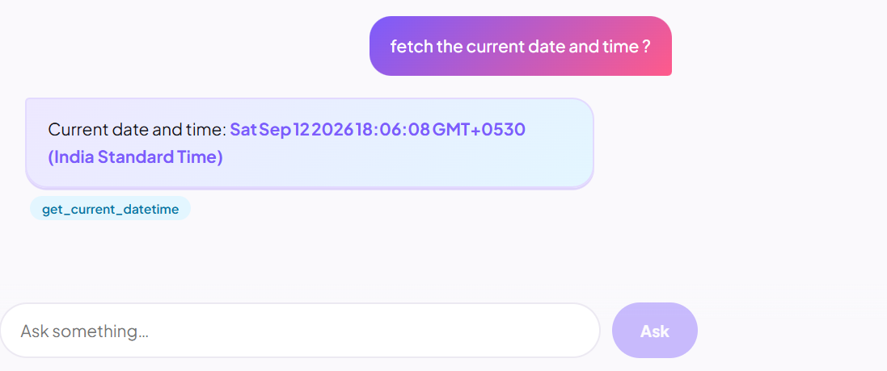
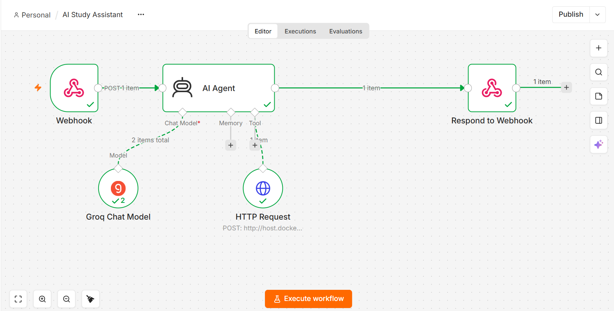

# AI Study Assistant

A study assistant that answers questions grounded in your own notes, using retrieval-augmented generation and an LLM agent that decides for itself when to search your notes versus answer from general knowledge — built by hand first, then rebuilt with LangChain/LangGraph and n8n to compare approaches.

## Live Demo

- **Frontend:** https://sensational-dango-4bd7a3.netlify.app
- **Backend API:** https://ai-study-assistant-ermy.onrender.com

> Note: the backend is hosted on Render's free tier, which spins down after inactivity — the first request after idle time may take 20–30 seconds to respond while it wakes up.

## Overview

This started as a learning project to understand how LLM applications actually work — not just how to call an API, but how retrieval, tool-calling, and agent decision-making function mechanically underneath the frameworks that usually hide them. Every capability here was implemented from scratch first, then reimplemented using industry-standard tools, so those tools are understood rather than trusted blindly.

## Features

- Ask any study question and get an answer from an LLM
- Add your own notes; the assistant answers using them when relevant, and says so
- An agent that decides whether to search your notes, check the current date, or answer directly — per question, with no hardcoded routing
- The same agent rebuilt three ways: hand-coded, via LangChain/LangGraph, and visually in n8n
- A working React frontend, and API-level protections (auth, rate limiting, input validation)

## AI Capabilities

- **LLM** — direct calls to Groq's `openai/gpt-oss-20b`, with a configurable system prompt, temperature, top_p, and max_tokens
- **RAG** — notes are chunked, embedded (Gemini), stored in a vector store, and retrieved by similarity to ground answers in real content instead of the model's general training knowledge
- **Tool calling** — the LLM can request `search_notes` or `get_current_datetime`; it decides per-question whether either is needed
- **AI Agent** — the same tool-calling loop, proven to chain multiple sequential tool calls when one tool's result reveals that another is also needed
- **LangChain / LangGraph** — the RAG pipeline and the agent rebuilt using framework components, for direct comparison against the hand-built versions
- **n8n** — the same agent capability rebuilt visually, self-hosted via Docker, calling this project's own API as a tool

## How It Works

**Retrieval-augmented generation (RAG):**
1. Notes are split into overlapping chunks
2. Each chunk is converted into an embedding (a vector representing its meaning)
3. Chunks and their vectors are stored together
4. When a question comes in, it's embedded the same way
5. The question's vector is compared against every stored vector (cosine similarity)
6. The closest matching chunks are retrieved and inserted into the prompt as context
7. The LLM answers using only that context — and says so plainly if nothing relevant was found

**Tool-calling agent:**
1. A question arrives, along with a list of available tools (just descriptions, not code)
2. The LLM decides: answer directly, or request a tool
3. If it requests a tool, the actual code runs — for `search_notes`, that means running the entire RAG process above; for `get_current_datetime`, it just reads the system clock
4. The tool's result is added to the conversation as a new message
5. The LLM looks at that result and decides again — answer now, or request another tool
6. This repeats until the LLM responds with a final answer instead of another tool request

The number of tools isn't fixed — this project defines two (`search_notes`, `get_current_datetime`), but the same loop would handle any number without structural changes.

## Architecture

```
User (browser)
      │
      ▼
React frontend (client/) ── calls ──▶ Express API (server.js)
                                          │
                              ┌───────────┼────────────┐
                              ▼           ▼             ▼
                        LLM (Groq)   Embeddings    Vector store
                        openai/      (Gemini)      (JSON file,
                        gpt-oss-20b                 cosine similarity)
                              │
                              ▼
                        Tool-calling loop
                        (search_notes, get_current_datetime)

Separately: an n8n workflow (Docker, localhost:5678) replicates the
same agent behavior visually — Webhook → AI Agent (Groq Chat Model +
an HTTP Request Tool calling this project's own /api/ask/rag) →
Respond to Webhook.
```

## Tech Stack

| Layer | Choice | Why |
|---|---|---|
| Backend | Node.js, Express | Existing backend skillset |
| Chat model | Groq (`openai/gpt-oss-20b`) | Free tier, fast, OpenAI-compatible |
| Embeddings | Google Gemini (`gemini-embedding-001`) | Free tier; Groq has no embedding API |
| Vector storage | Hand-built JSON file + cosine similarity | Makes the mechanics visible; swappable for a real vector DB later |
| Frameworks | LangChain, LangGraph | Industry-standard, rebuilt for comparison against the hand-built version |
| Visual automation | n8n (self-hosted via Docker) | Free, unlimited self-hosted tier vs. n8n Cloud's paid plan |
| Frontend | React + Vite | Fast dev loop |
| Markdown rendering | react-markdown | Renders the LLM's formatted answers properly |
| Security/reliability | express-rate-limit, custom middleware | API key auth, rate limiting, validation, logging, error handling |
| Hosting | Netlify (frontend), Render (backend) | Free tiers, simple git-based deploys |

## Project Structure

```
ai-study-assistant/
├── server.js
├── .env                    (not committed)
├── data/
│   └── vectorStore.json    (not committed — regenerated via /api/ingest)
├── client/                 React + Vite frontend ("Study Notebook")
│   └── src/
│       ├── App.jsx
│       └── components/
└── src/
    ├── config/             Groq + Gemini client setup
    ├── controllers/        HTTP request/response handling
    ├── middleware/         auth, rate limiting, logging, guardrails, errors
    ├── routes/             URL → controller wiring
    ├── services/           the actual logic (LLM calls, RAG, tool-calling)
    └── tools/              individual tool definitions for the agent
```

## API Endpoints

All routes are mounted under `/api`, require an `x-api-key` header, are rate-limited (20 requests/minute per IP), and validate their input before doing any LLM work.

| Method & Path | Body | What it does |
|---|---|---|
| `POST /api/ask` | `{ question, temperature?, top_p?, max_tokens? }` | Plain LLM call with a study-tutor system prompt |
| `POST /api/ask/structured` | `{ question }` | Same, but forces a structured JSON response |
| `POST /api/ingest` | `{ text }` | Chunks, embeds, and stores study notes |
| `POST /api/ask/rag` | `{ question }` | Answers strictly from ingested notes, or says it can't find it |
| `POST /api/ask/tools` | `{ question }` | Full agent: can call `search_notes` and/or `get_current_datetime` as needed |
| `POST /api/langchain/ingest` | `{ text }` | Same as `/api/ingest`, via LangChain's embedding wrapper |
| `POST /api/langchain/ask/rag` | `{ question }` | Same as `/api/ask/rag`, via a LangChain LCEL chain |
| `POST /api/langchain/ask/agent` | `{ question }` | Same as `/api/ask/tools`, via LangGraph's `createReactAgent` |

## Setup & Installation

```bash
# backend
cd ai-study-assistant
npm install

# frontend
cd client
npm install
```

## Environment Variables

**Backend `.env`:**
```
GROQ_API_KEY=your_groq_key
GEMINI_API_KEY=your_gemini_key
API_KEY=choose_any_secret_string
PORT=3000
```

> On Render, the platform assigns its own port via `process.env.PORT` at runtime (the app reads this automatically) — the `PORT=3000` above only applies when running locally.

**Frontend `client/.env`:**
```
VITE_API_KEY=same_secret_as_backend_API_KEY
```

## Running the Project

> For a quick look, use the [Live Demo](#live-demo) above — no setup required.

To run locally:

```bash
# terminal 1 — backend
cd ai-study-assistant
npm run dev

# terminal 2 — frontend
cd client
npm run dev
```

Open `http://localhost:5173`. The backend must be running on port 3000 at the same time.

## n8n Workflow

```bash
docker run -it --rm --name n8n -p 5678:5678 -v n8n_data:/home/node/.n8n docker.n8n.io/n8nio/n8n
```

Open `http://localhost:5678`. The workflow: **Webhook → AI Agent** (Groq Chat Model + an HTTP Request tool pointing at `http://host.docker.internal:3000/api/ask/rag`) **→ Respond to Webhook**. The AI Agent decides whether to call the tool per question, exactly like the hand-built and LangGraph agents.

## Production Features

- **API key authentication** — every request must include a valid `x-api-key` header, checked before anything else runs
- **Rate limiting** — max 20 requests per minute per IP, protecting API costs and preventing abuse
- **Input validation (guardrails)** — rejects empty or oversized input before it reaches an LLM call
- **Request logging** — every request logs its method, path, status code, and duration
- **Centralized error handling** — a catch-all handler ensures unexpected errors return a clean response instead of crashing the server
- **Token/cost visibility** — every LLM call logs its actual token usage

## Screenshots

<!-- Frontend in action — add this first, it's the clearest demonstration -->


<!-- n8n workflow canvas -->


## What I Learned

- The mechanics behind RAG and agentic tool-calling — not just how to call `langchain.someMethod()`, but what it's actually doing underneath
- That "agent" means the model decides which action to take, not that a system runs on a schedule by itself — automation and agentic behavior are related but separate concepts
- Real debugging: stale `.env` values after key rotation (nodemon doesn't watch `.env`), Docker container networking (`host.docker.internal`), provider model deprecations (Groq renamed/moved several models mid-project), and credential formatting quirks in n8n
- That hallucinations aren't hypothetical — I deliberately triggered one, diagnosed it, and fixed it with an explicit instruction, rather than assuming a system prompt works
- That the same underlying capability (an agent with tools) can be expressed at very different levels of abstraction — raw code, a framework, or a no-code canvas — and it's the same idea every time
- That a hosted server's filesystem isn't guaranteed to persist or even pre-exist — code that assumes a local folder is already there (fine on localhost) needs to create it defensively once deployed

## Future Improvements

- A real vector database instead of a JSON file, once note volume grows
- A proper evaluation suite — testing the agent against many questions systematically, not just targeted manual checks
- Cleaner Markdown table rendering in the frontend for LLM responses containing tables
- A genuine scheduled automation example in n8n (e.g., a daily summary), separate from the on-demand agent behavior already built
- A tool connecting to a separate existing project (a college ERP system) so the agent can answer questions using real external data, not just personal notes